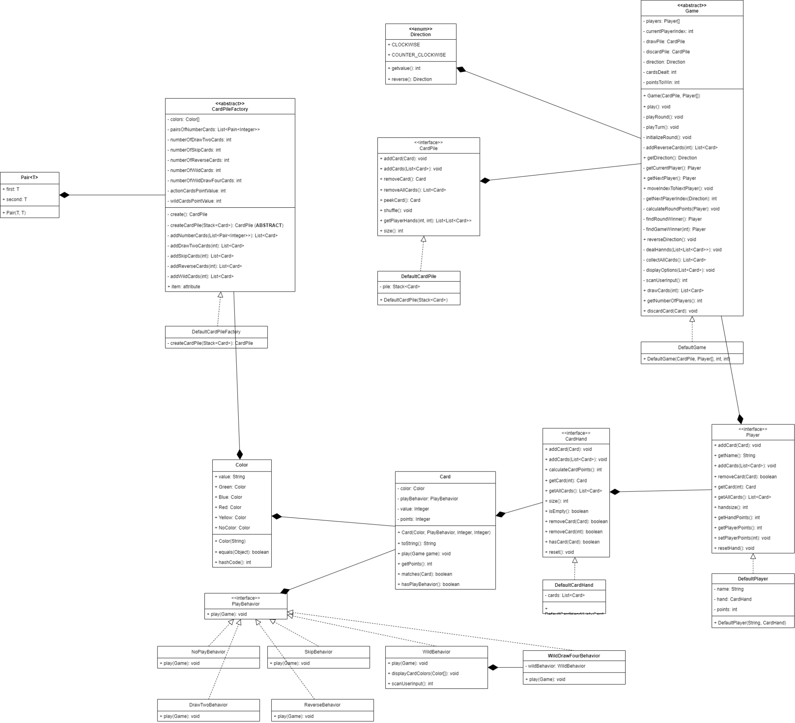

# Table of Contents
- [Overview of the Project](#overview-of-the-project)
- [Object-Oriented Design](#object-oriented-design)
- [Design Patterns Used](#design-patterns-used)
- [Clean Code Principles (Uncle Bob)](#clean-code-principles-uncle-bob)
- [Effective Java Items (Joshua Bloch)](#effective-java-items-joshua-bloch)
- [SOLID Principles](#solid-principles)
- [Conclusion](#conclusion)

# Overview of the Project
The goal of this project is to design and implement an engine for the Uno card game. The game of Uno is traditionally played by 2 to 10 players and involves a deck of 108 cards that include numbered cards, action cards, and wild cards. Each player begins with seven cards, and gameplay involves a range of rules and strategies.

My task was to build an Uno game engine in Java using object-oriented programming (OOP) principles. The objective was to develop a flexible and reusable codebase, allowing other developers to create their own variations of Uno by simply extending our abstract `Game` class and implementing the necessary abstract methods. I also aimed to offer a predefined set of game rules that developers can choose from when creating their own game variations.

Our code includes a method named `play` within the `Game` class to simulate the game, and other methods as required. We prioritized extensibility, allowing developers to add more game rules, introduce new cards, or card dealing mechanisms to our engine with minimal effort.

# Object-Oriented Design
- **Card Class**: 
  - The card structure uses a single `Card` class with properties like `color`, `playBehavior`, `value`, and `points`. 
  - By combining different references for these properties, various cards in the game can be represented. 
  - For example, a `Card` with `DrawTwoBehavior`, `Red` color, `null` value, and `20` points would represent a draw two card.
  - The class holds a simple `toString` method and a method for matching it with other cards, which is used for validating that two cards match.

- **PlayBehavior Interface**: 
  - This interface includes one method, `play()`, which takes a reference to a game and modifies its state according to the behavior implemented in any class that implements this interface.
  - This allows injecting different behavior implementations with different play effects into the `Card` class, providing great extensibility for further development from other users.

- **Behavior Implementations**: 
  - Classes like `DrawTwoBehavior`, `SkipBehavior`, `ReverseBehavior`, `WildBehavior`, `WildDrawFourBehavior`, and `NoBehavior` implement the `PlayBehavior` interface.
  - Each class modifies the game state as each card should.
  - The `NoBehavior` class is created to avoid null references for cards that have no effects, like number cards.
  - `WildDrawFourBehavior` references a `WildBehavior` object to call its play method since it's included in the `WildDrawFourBehavior`.

- **Color Class**: 
  - This class has a `String` value representing the color of the object.
  - For simplicity, some static members represent the initial color values for the game, such as `Red`, `Blue`, `Yellow`, `Green`, and `NoColor`.
  - The `NoColor` object is used for cards that have no color, avoiding null references as much as possible.

- **CardHand Interface**: 
  - This interface defines methods that manage a hand of cards, like adding a card, removing a card, and resetting a hand.

- **DefaultCardHand Class**: 
  - This class is the default implementation of the `CardHand` interface using a `List` collection type.

- **Player Interface**: 
  - This interface represents a player and is responsible for the player's information, like name, `CardHand`, and points.
  - It contains methods like adding a `List` of cards, removing all cards, getting and setting the player's points and name, and calculating the sum of points their hand represents.

- **DefaultPlayer Class**: 
  - This is the default representation of a player. Other developers can use other representations by implementing the `Player` interface in their own way.

- **CardPile Interface**: 
  - This interface represents the piles of cards used in play—the draw pile and the discard pile.
  - It has methods like removing a card, adding a card, shuffling, and peeking.
  - It also has a method for dealing that takes the number of players and the number of cards for each player and does the appropriate drawing to return a collection of card collections that will be handed to the players.

- **DefaultCardPile Class**: 
  - I implemented the `DefaultCardPile` using a `Stack` data structure. It felt intuitive since a pile behaves like a stack—you can only draw from the top and add to the top, similar to drawing from the top of the draw pile and matching cards on top of the discard pile.

- **CardPileFactory Abstract Class**: 
  - To help users construct the desired `CardPile` with its many cards and variations, I created an abstract class.
  - This class has properties that represent the building blocks for the `CardPile`, like colors of cards, the number of skip cards, the number of reverse cards, and so on.
  - It also contains private methods that help create those cards with the provided configurations.
  - It only has one abstract method, `createCardPile`.

- **DefaultCardPileFactory Class**: 
  - This class extends the abstract factory and implements the abstract `createCardPile` method by returning a new instance of `DefaultCardPile`.
  - With this factory, I give the developer the ability to create a `DefaultCardPile` with different card numbers and quantities. They can also extend their own factories to build their own new `CardPiles`.

- **Game Abstract Class**: 
  - This is the main abstract class in the project. It contains the main properties of players, draw and discard piles, direction of play, constants representing the required points to win the game, and the number of cards dealt to players when starting a round.
  - Its main responsibilities include initializing and starting the game, playing rounds, and managing all the other classes in the system to manipulate the game state.

- **DefaultGame Class**: 
  - This is the default implementation of the `Game` abstract class with sane defaults, such as points needed to win and starting cards in hand. Developers are free to extend the abstract class as they please.

Here is the UML Diagram for my work:

# Design Patterns Used
- **Strategy Design Pattern**: 
  - I heavily relied on this design pattern because it covers a great deal of the project's complexity while providing great extensibility.
  - This pattern allowed me to inject different behaviors/strategies into my objects, giving me the ability to extend the strategy or behavior at any point in time.
  - I used this design pattern in my `PlayBehavior`, `CardHand`, `CardPile`, `Player`, and any other part of the code that has an interface.

- **Factory Method Design Pattern**: 
  - I used this design pattern to abstract away the logic of `CardPile` creation while giving the developer the ability to extend that logic and mold it as they desire.
  - They could extend the factory and only modify the card config properties, allowing them to use my `DefaultCardPile` implementation with different card configs. They could also extend it further by adding their own card config for their newly added cards and helper methods to help create those cards.

- **Facade Design Pattern**: 
  - This pattern provides a simplified interface to a library, a framework, or any other complex set of classes.
  - I used this design pattern in my `Game` class to abstract away the complexity of the library.

# Clean Code Principles (Uncle Bob)
- **Meaningful Names**: 
  - I tried diligently to keep the names as meaningful as possible and followed a common structure in naming things.
  - I have OCD when it comes to cleanliness and organization, and I even used some AI help to suggest great names sometimes.

- **Functions Should Do One Thing**: 
  - I believe more than 80% of my codebase abides by this rule. What helped me the most is keeping the function within screen view.
  - I must always be able to see the whole method on my device screen.

- **DRY (Don’t Repeat Yourself)**: 
  - My Strategy pattern abstractions helped me immensely to share code horizontally in my hierarchies, resulting in minimal code duplication.

- **Law of Demeter**: 
  - A class should know about its friends, not the friends of its friends. This means a class should invoke methods on only its references and not on the references of its properties.

# Effective Java Items (Joshua Bloch)
- **Consider Static Factory Methods Instead of Constructors**: 
  - Static factory methods have names, unlike constructors, which can clarify the code. 
  - They aren't required to create a new object each time they're invoked, which could potentially provide performance benefits. 
  - Also, better reusability: I only have to call the factory once and invoke its create method to receive an instance of the `CardPile`.

- **Favor Composition Over Inheritance**: 
  - Unlike method invocation, inheritance breaks encapsulation. 
  - It's best to use composition and forwarding instead of inheritance, especially when it comes to an existing class not designed for inheritance. 
  - Inheritance prevents modifying objects dynamically.

- **Design for Inheritance or Else Prohibit It**: 
  - Because it is so difficult to design an inheritance-ready class, I chose to prevent the possibility of extending a class by making most of my classes final.

- **Use Interface to Define Types**: 
  - I employed the use of interfaces to better utilize Java's multiple inheritance benefits. 
  - This allowed me to hide the implementation details in the concrete class while exposing a higher level of abstraction to my users.

# SOLID Principles
- **Single Responsibility Principle (SRP)**: 
  - Every class should have one reason to change, meaning that every class should only have one job.
  - I adhered to this principle by applying SRP to every class. Each class has one responsibility and nothing more.

- **Open/Closed Principle (OCP)**: 
  - Objects or entities should be open for extension but closed for modification.
  - The structure of my code allows the developer to extend the project easily without modifying the current implementation, thanks to my reliance on Strategy Design Patterns and abstraction.

- **Liskov Substitution Principle (LSP)**: 
  - Objects of a superclass should be replaceable with objects of a subclass without affecting the correctness of the program.
  - This principle was followed by having my code reference interfaces instead of concrete classes.

- **Interface Segregation Principle (ISP)**: 
  - A client should never be forced to implement an interface that it doesn’t use, and clients shouldn’t be forced to depend on methods they do not use.
  - I provided the interfaces, and each one of them has only one responsibility. If a user wants multiple functionalities, they can implement the interface that meets their needs.

- **Dependency Inversion Principle (DIP)**: 
  - Entities must depend on abstractions, not on concretions. 
  - It states that the high-level module must not depend on the low-level module but should depend on abstractions.
  - I made sure my code depends on abstractions for `Player`, `CardPile`, `Game`, `CardHand`, `PlayBehavior`, and so on. 
  - This allows for better code maintenance and future updates without breaking existing code.

# Conclusion
I had an amazing time designing and implementing this project, which included countless refactors and challenges. The result is a highly reusable, extensible, and well-designed system for Uno.

I followed the best practices in OOP, used design patterns to simplify code extension, and applied clean code principles. I also implemented SOLID principles to ensure my project is well-structured and flexible. This project was a great learning experience and gave me deep insights into building robust systems.
